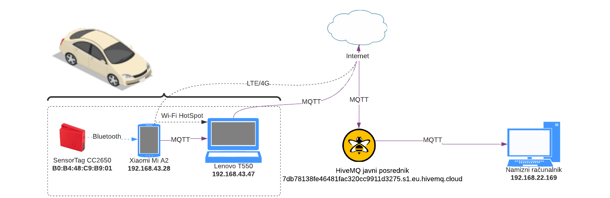

# Zaznavanje-trkov-MQTT
Poenostavljeno zaznavanje trkov v avtomobilih s pomočjo protokola MQTT.


Repozitorij vsebuje datoteke in programe opisane v diplomskem delu: "Uporaba protokola MQTT v avtomobilih".
Datoteke so:
* ```MQTT_veriga.db``` - sqlite3 podatkovna baza, kjer se shranjujejo **podatki senzorjev**.
* ```seznam.txt``` - krajši seznam pogostih gesel (le 1000).
* ```aclfile.example``` - konfiguracijska datoteka, ki definira **pravice uporabnikov**.
* ```mosquitto.conf``` - **glavna konfiguracijska datoteka** mosquitto MQTT posrednika. Med ostalim, določa nastavitve **avtentikacije** in **avtorizacije**, uporabo SSL-a in podobno.

Programi so:
* ```skripta.py``` - skripta, ki se naroči na korensko temo posrednika MQTT in **posluša vsa sporočila** ostalih odjemalcev (**primer neustrezne avtorizacije**)
* ```bruteforce.py``` - skripta, ki izvaja **napad z grobo silo**. Ustvari množico odjemalcev in zaporedoma skuša uganiti geslo s pomočjo seznama najpogostejših gesel.
* ```initialize.py``` - skripta, ki **ustvari** lokalno **podatkovno bazo**.
* ```listen.py``` - skripta, ki **definira** in **zažene mosquitto MQTT posrednika**. Ob prispetju sporočila kliče ustreznega **krmilnika** (funkcijo) v programu store.py.
* ```store.py``` - skripta, ki vsebuje **logiko zaznavanja trkov**. Podatke senzorjev **shrani v podatkovno bazo**. V primeru da so razlike v meritvah **žiroskopa** precejšnje (sum avtomobilskega trka) zažene skripto hivemq.py. 
* ```hivemq.py``` - skripta, ki se sproži ob sumu na avtomobilski trk. Ustvari odjemalca MQTT, ki pošlje ustrezno **opozorilo na oddaljeni HiveMQ posrednik**. 


